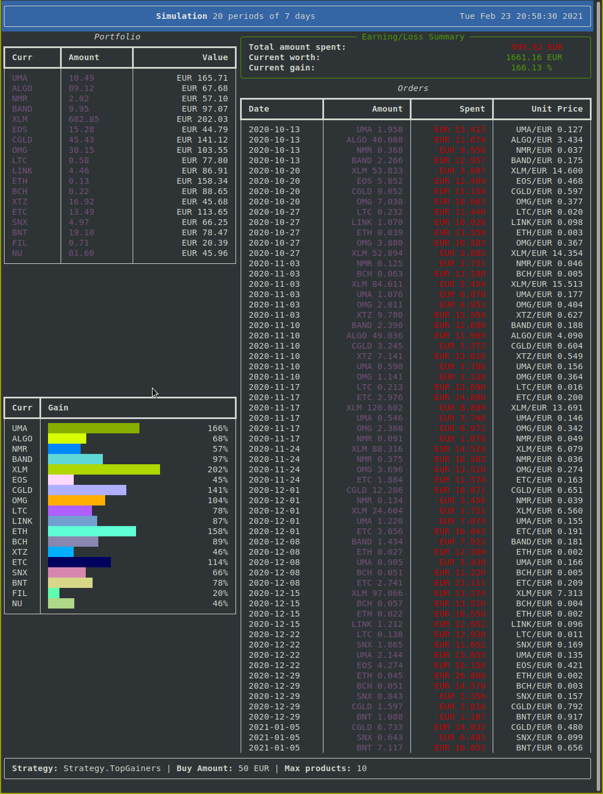

# Coinbase Diversified Portfolio
This project consist of a simple "trading" application that perform **recurring** purchases of crypto products from Coinbase Pro based on simple strategies.

Basically the algorithm does the following:
1) Gets all tradable product for the given market (e.g. `EUR`)
2) Gets the historical tickers of all tradable products for the interval specified (`--interval`)
3) It computes the trends for every product based on how much it gained across the interval given
4) Based on the `--limit` parameter it selects only a subset of the products trends
5) Based on the specified strategy it select the products to buy
    * `gainer`: select the top gaining products
    * `loser`: select the top loosing products
    * `mixed`: alternate `gainer` and `loser` at every run
6) Divide the given amount (`--amount`) based on the gain/loss
7) Execute trading orders

## Getting started

In order to generate **real** orders and access account balance you need an API key for Coinbase Pro. You can get one at https://pro.coinbase.com/profile/api. 
Please use the config template `config.template.json` to create a new `config.json` with your API info.

```json
{
    "url": "API endpoint",
    "key": "ID of API key",
    "passphrase": "passphrase",
    "b64secret": "Base64 encoded secret"
}
```

If you only want to simulate, you dont need anything (using public API endpoint).

Please install dependencies via `requirements.txt`:
```bash
pip3 install -r requirements.txt
```

## Simulation
Explore the options with `./trader.py simulate --help` or just run it straight with: `./trader.py simulate` to generate a simulation with default parameters.



## Trading
When running `./trader.py run` make sure you specify the right `--config` file.
Orders gets executed automatically, **please use a sandbox API if you just want to thes this out!**.

> The sandbox endpoint only offer a very small subset of markets, thats why executing orders will mostly fail with `Product not found` error.

```bash
$ ./trader.py run --config=config.sandbox.json

# --- OUTPUT CUT ---

Trends:
-------
BNT-EUR: 36.27%
ETC-EUR: 21.73%
BCH-EUR: 19.49%
LTC-EUR: 14.61%
CGLD-EUR: 12.15%
BTC-EUR: 11.59%
LINK-EUR: 9.64%
EOS-EUR: 8.24%
OMG-EUR: 5.85%
ETH-EUR: 4.68%

Executing orders:
-------
Executing BNT-EUR order 14.1939 EUR
Failed to execute order: {'message': 'Product not found'}
Executing BCH-EUR order 14.28 EUR
Failed to execute order: {'message': 'Product offline'}
Executing CGLD-EUR order 9.2747 EUR
Failed to execute order: {'message': 'Product not found'}
Executing EOS-EUR order 10.214 EUR
Failed to execute order: {'message': 'Product not found'}
Executing OMG-EUR order 2.0278 EUR
Failed to execute order: {'message': 'Product not found'}
```